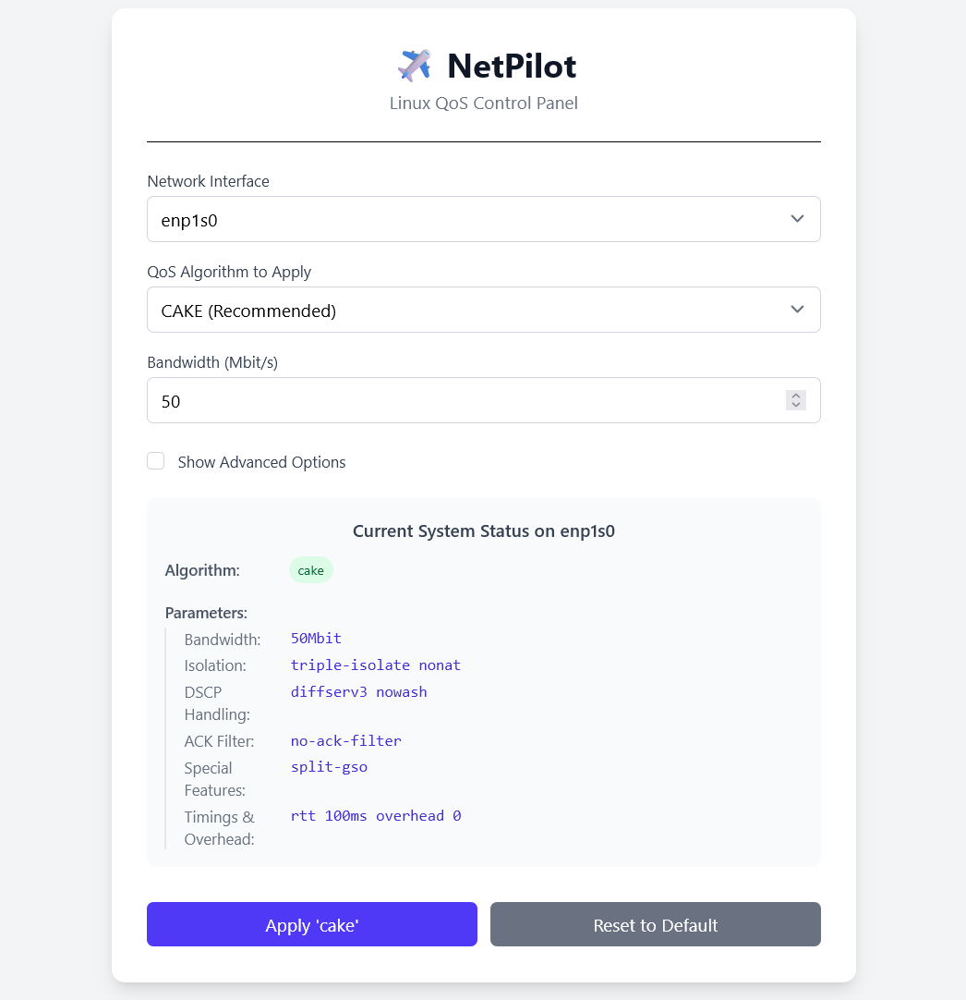

<div align="center">

**[English](README.md)** | **[简体中文](README.zh-CN.md)**

</div>


<h1 align="center">✈️ NetPilot</h1>

<br>

<div align="center">
  
</div>

<p align="center">
  A simple, modern Web UI for managing Linux QoS with algorithms like CAKE and fq_codel.
  <br>
  <a href="LICENSE">
    
  </a>
</p>

This project aims to provide a user-friendly interface for the powerful but complex Linux Traffic Control (TC) subsystem. It helps solve common network latency issues (Bufferbloat) by making the configuration of advanced queueing disciplines simple and accessible.

## ✨ Core Features

*   **Intuitive UI**: A clean and simple web interface to manage your QoS rules.
*   **Algorithm Support**: Apply and manage popular classless qdiscs like `cake`, `fq_codel`, `tbf`, and `sfq`.
*   **Real-time Status**: View the current, active QoS rule on your network interfaces directly from the UI.
*   **Single Binary**: The Go backend and Svelte frontend are compiled into a single, easy-to-deploy executable.

## 🛠️ Tech Stack

*   **Backend**: Go (using `os/exec` to interface with `tc`)
*   **Frontend**: SvelteKit + Tailwind CSS

## 🚀 Getting Started (Development)

**Prerequisites:**
*   Go (1.25+)
*   Node.js (24.x+) with pnpm
*   A Linux environment.

**Development Mode:**
1.  **Start the Backend API Server:**
    ```bash
    # From the project root
    NETPILOT_DEV_MODE=true go run main.go
    ```
2.  **Start the Frontend Dev Server:**
    ```bash
    # From the 'frontend' directory, in a new terminal
    cd frontend
    pnpm install
    pnpm run dev
    ```
3.  Open `http://localhost:5173` in your browser.

## 📜 License

This project is licensed under the [MIT License](LICENSE).