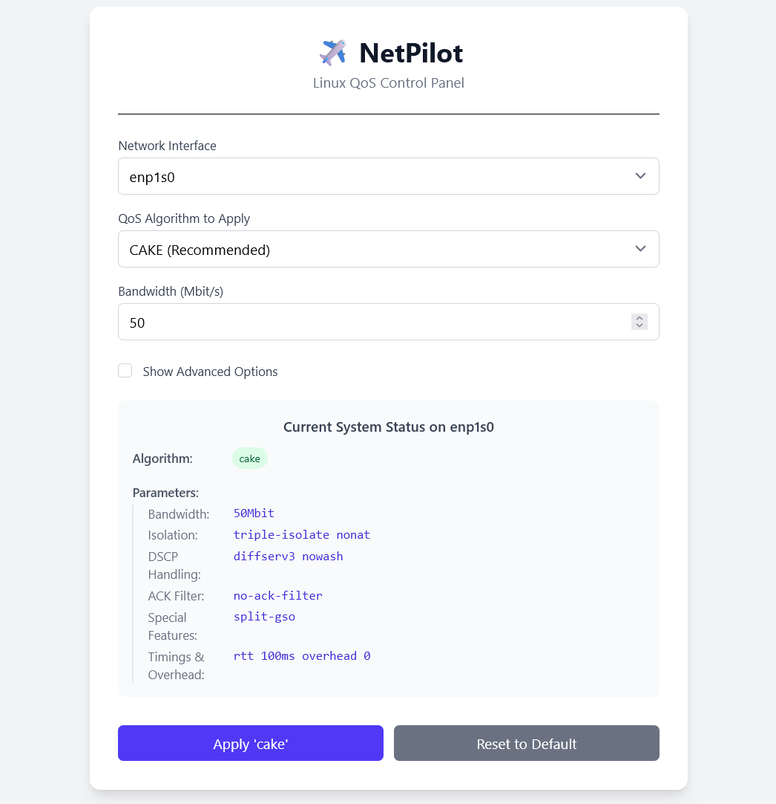

<div align="center">

**[English](README.md)** | **[简体中文](README.zh-CN.md)**

</div>

<br>

<div align="center">
  
</div>

<h1 align="center">✈️ NetPilot</h1>

<p align="center">
  一个用于管理Linux QoS（如CAKE、fq_codel算法）的、简洁的现代化Web UI。
  <br>
  <a href="LICENSE">
    
  </a>
</p>

本项目的目标，是为强大而复杂的Linux流量控制（TC）子系统，提供一个用户友好的界面。它致力于通过简化高级队列规则的配置，来解决常见的网络延迟问题（Bufferbloat）。

## ✨ 核心特性

*   **直观的UI**: 一个干净、简单的Web界面，用于管理您的QoS规则。
*   **算法支持**: 应用和管理流行的“无类”队列规则，如`cake`, `fq_codel`, `tbf`, `sfq`。
*   **实时状态**: 直接在UI中，查看您网络接口上当前生效的QoS规则。
*   **单一可执行文件**: Go后端和Svelte前端被编译成一个易于部署的单一程序。

## 🛠️ 技术栈

*   **后端**: Go (使用`os/exec`与`tc`命令交互)
*   **前端**: SvelteKit + Tailwind CSS

## 🚀 快速开始 (开发环境)

**前提条件:**
*   Go (1.25+)
*   Node.js (24.x+) 及 pnpm
*   一个Linux环境。

**开发模式:**
1.  **启动后端API服务器:**
    ```bash
    # 在项目根目录
    NETPILOT_DEV_MODE=true go run main.go
    ```
2.  **启动前端开发服务器:**
    ```bash
    # 在一个新的终端里，进入 'frontend' 目录
    cd frontend
    pnpm install
    pnpm run dev
    ```
3.  在浏览器中打开 `http://localhost:5173`。

## 📜 许可证

本项目采用 [MIT 许可证](LICENSE) 开源。